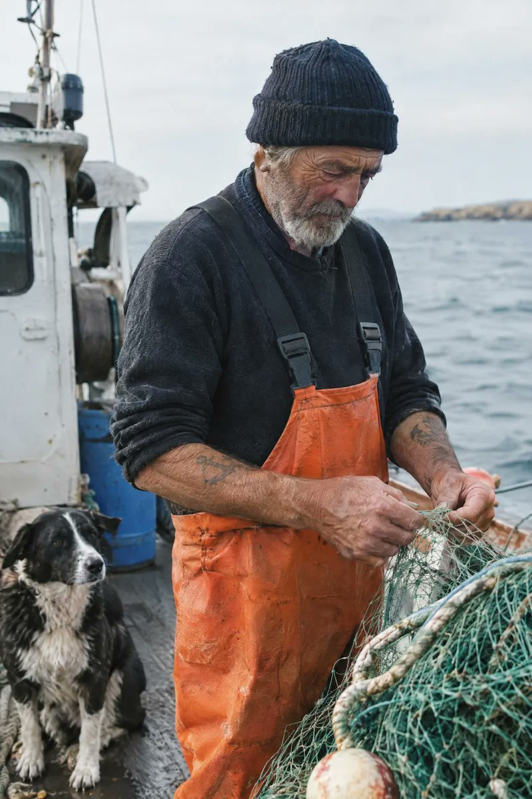
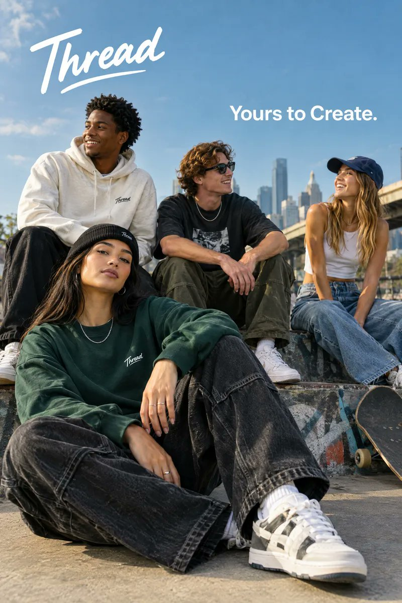
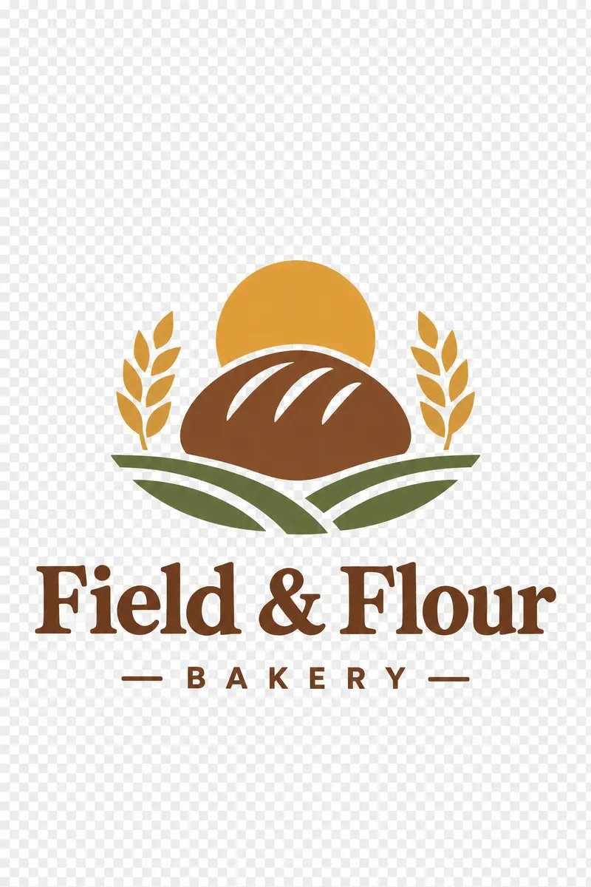
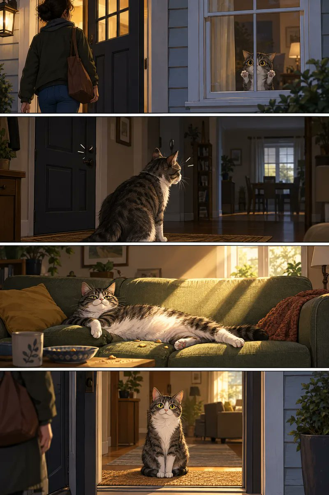
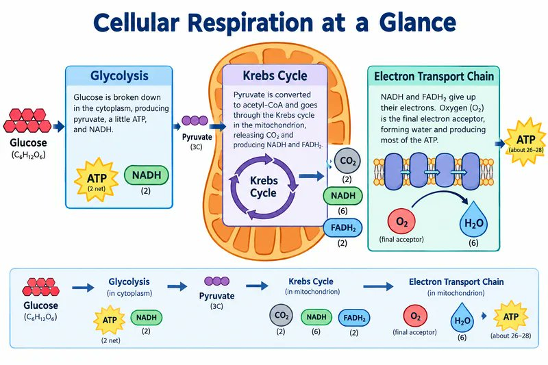
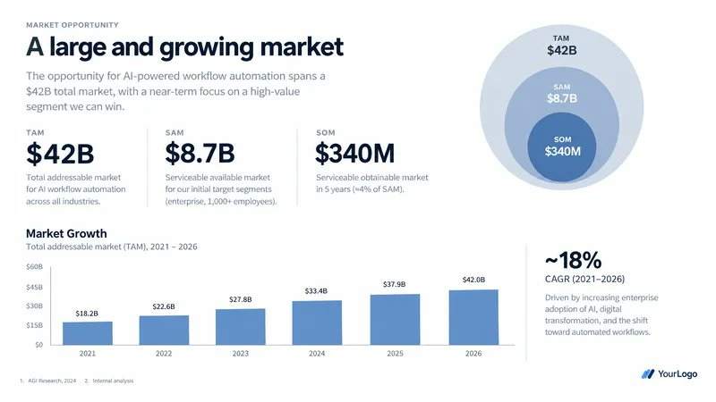
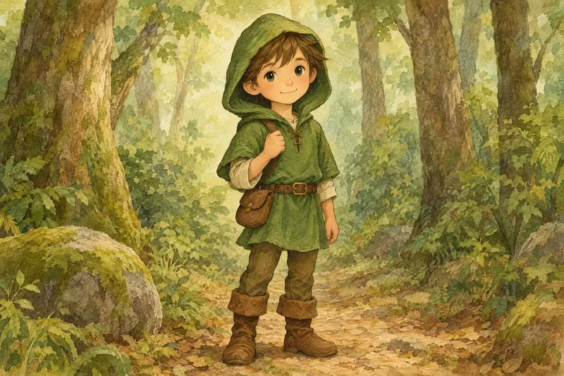
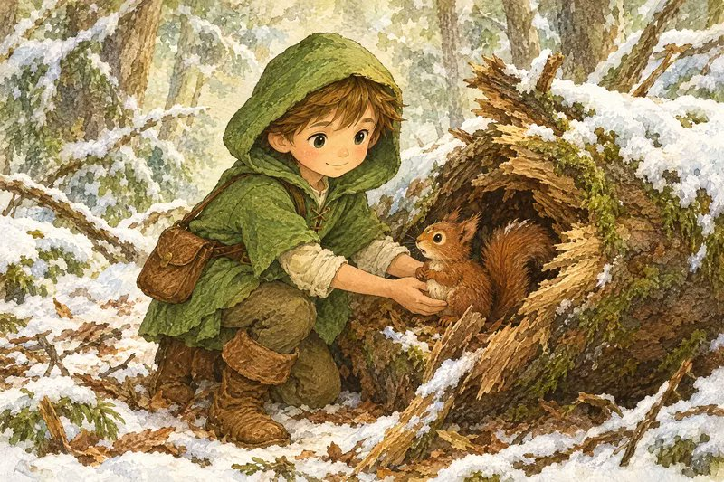
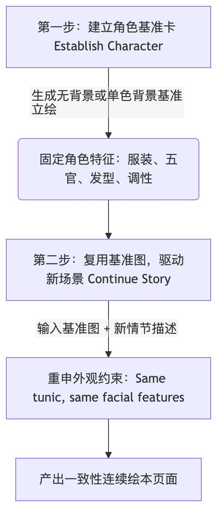

从底层双模型架构选型，到参数解耦设计，再到官方首次系统性披露的 8 大提示词法则与 12 类高频实操工作流，这份文档宣告了一个明确的趋势：

AI 图像生成与编辑，已经彻底从「堆砌玄学风格词」进入到了「工程化规格说明（Spec-driven Prompting）」时代。

本文最初发布于 [X](https://x.com/ninthbit_ai/status/2097608695286988862)，依据官方 [Image Prompting Guide](https://developers.openai.com/api/docs/guides/image-prompting) 整理。下面是核心干货与实战模版。

## 底层变革：认识 GPT Image 2.5 双模型与参数解耦

在动笔写任何提示词之前，首先要厘清 GPT Image 2.5 的底层机制。这一次 OpenAI 采用了双模型策略，并强调将系统参数与语义提示词彻底解耦。

### 双模型选型逻辑：Flare 与 Sunburst

**GPT Image 2.5 Flare（极速小模型）**

- 核心定位：极致延迟优化、高吞吐量
- 画质基准：画质与 GPT Image 2 相当，但生成速度显著提升
- 适用场景：实时交互应用、草图初筛、成本敏感型或高并发业务流

**GPT Image 2.5 Sunburst（画质基模）**

- 核心定位：极致画面质量、高精细节还原
- 画质基准：画质全面超越 GPT Image 2，尤其在复杂结构与文字渲染上表现突出
- 适用场景：商业级主视觉、高精印刷、复杂图表与高难度局部编辑

官方选型建议：

1. 已有稳定业务流：若 GPT Image 2 已能满足质量要求，首选测试 Flare，验证在同等画质下能否大幅压缩推理延迟。
2. 复杂高要求场景：若现有模型画质不足，先使用 Sunburst 建立画质基线；达标后再测试 Flare 是否能平替。不要脱离具体业务负载凭空推测耗时与成本。

### 关键 API 参数解耦指南

OpenAI 特别强调：能用参数控制的属性，绝不要堆在 Prompt 里。

| 参数                  | 可选值                                           | 官方建议                                                                                                           |
| --------------------- | ------------------------------------------------ | ------------------------------------------------------------------------------------------------------------------ |
| 模型选型 `model`      | `gpt-image-2.5-flare` / `gpt-image-2.5-sunburst` | 根据场景质量与延迟权衡选型                                                                                         |
| 画质等级 `quality`    | `auto`, `low`, `medium`, `high`, `xhigh`, `max`  | 默认 `auto`。小字号、密集信息图、复杂图表建议直接上 `high`；`xhigh` / `max` 仅在延迟与成本预算充裕时选用           |
| 输出尺寸 `size`       | `auto` 或自定义 `WIDTHxHEIGHT`                   | 常见比例：`1024x1024`（方形）、`1536x1024`（横版）、`1024x1536`（竖版）、`2048x1152`（2K 横版）、`3840x2160`（4K） |
| 背景通道 `background` | `auto`, `opaque`, `transparent`                  | 重大更新——原生透明通道。需要抠图透明素材时，显式设置 `transparent`，搭配 PNG / WebP 格式                           |

注意：超过 3,686,400 像素（即 `2560x1440`）的输出目前为实验性。

## 官方核心心法：8 大提示词工程法则

OpenAI 在文档中提炼了高质量图像生成与编辑的 8 项基本原则，每一条都直击以往「跑图摸奖」的痛点。

### 1. 像写产品规格说明一样「定义结果」

明确主体与最终交付场景（是电商白底图、社交媒体广告，还是工程架构图）。

复杂需求推荐采用结构化分段：

- 场景（Scene）
- 主体（Subject）
- 细节（Details）
- 约束（Constraints）

### 2. 采用可维护的提示词格式

短语、叙事段落、类 JSON 结构、带有层级的指令标签，均可被准确理解。

重点是团队易读、易维护、易做版本回溯，而非盲目追逐某种神秘的「魔法语法」。

### 3. 用「具体可见的细节」取代情绪空话

避免使用：`masterpiece, super realistic, 8k, epic lighting, amazing atmosphere`（杰作、超高清、史诗感等抽象词汇）。

明确指出：材质（如风化的皮革、拉丝不锈钢）、布光（如午后 45 度柔和侧光、冷色调散射自然光）、色彩体系与拍摄介质（如 35mm 胶片质感、50mm 镜头视角、微弱暗角）。相机参数被模型视为视觉风格提示，而非严格的物理光学模拟。

### 4. 具象化人物姿态与交互

不仅要写人物特征，还要锁定三个关键维度：

- 身体构图：如「全身可见，包含双脚」
- 视线朝向：如「低头注视手中的书籍」
- 与环境的真实交互：如「双手自然抓握自行车把手」

这样才能避免肢体僵硬或假人感。

### 5. 精确文本排版必须加「双引号」

这是 GPT Image 2.5 的核心王牌能力：

- 渲染文字必须用双引号包裹，并显式指定出现频次：`Render the tagline "Yours to Create" exactly once`。
- 标明排版位置与字体特征（如无衬线粗体、居中、高对比度）。
- 生僻字或专有品牌名可逐字母拼写，并加上 `No extra text, no watermarks`（无多余文字、无水印）等负向约束。

### 6. 编辑模式下「分离改动与约束」

在进行二次编辑（Edit）时，核心公式是：

**仅修改 [X]，保持 [A、B、C] 严格不变**

明确列出受保护属性：

- 人物身份特征（Identity）
- 五官结构
- 环境光照
- 相机机位
- 背景元素等

### 7. 为多图参考分配明确角色

当传入多张参考图时，必须为每张图编号并指定分工：

例如：「图 1 作为背景与光影基准，图 2 中的主体狗提取并置入图 1 的人物身旁，保持透视与投影一致。」

### 8. 严控变量，单步渐进迭代

将上一轮满意的输出作为下一轮的输入，每次只调整一个单一变量。如果画面细节出现漂移，及时在 Prompt 中重申受保护的关键约束。

## 实战拆解：商业级图像生成典型范例

官方指南中展示了大量可直接落地的经典案例，涵盖品牌设计、信息图表、UI 原型、商业路演等场景。

### 案例 1：胶片写实人像与自然光影控制

要点：通过描述岁月痕迹、真实肤质、胶片颗粒与自然采光，拒绝假面感。

生成参数：`size="1024x1536"`, `quality="medium"`

```text
Create a photorealistic candid photograph of an elderly sailor standing on a small fishing boat.
He has weathered skin with visible wrinkles, pores, and sun texture, and a few faded traditional sailor tattoos on his arms.
He is calmly adjusting a net while his dog sits nearby on the deck. Shot like a 35mm film photograph, medium close-up at eye level, using a 50mm lens.
Soft coastal daylight, shallow depth of field, subtle film grain, natural color balance.
The image should feel honest and unposed, with real skin texture, worn materials, and everyday detail. No glamorization, no heavy retouching.
```



解析：明确指出 `unposed`（抓拍感）、`visible wrinkles, pores`（可见毛孔皱纹）与 `No heavy retouching`（拒绝重度修图），能有效抑制塑料感磨皮。

### 案例 2：商业广告级精准文本排版

要点：指定品牌调性、文案频次、排版融合与负向过滤。

生成参数：`size="1024x1536"`, `quality="medium"`

```text
Give me a cool in culture ad / fashion shot for a brand called Thread.
It's a hip young street brand. The ad shows a group of friends hanging out together with the tagline "Yours to Create."
Make it feel like a polished campaign image for a youth streetwear audience: stylish, contemporary, energetic, and tasteful.
Use clean composition, strong color direction, natural poses, and premium fashion photography cues.
Render the tagline exactly once, clearly and legibly, integrated into the ad layout.
No extra text, no watermarks, no unrelated logos.
```



解析：`Render the tagline exactly once`（仅渲染一次）是避免模型在画面多处乱印文字的关键句式。

### 案例 3：原生透明背景矢量标志设计

要点：原生 Alpha 通道透明底、留白间距与跨尺寸清晰度。

生成参数：`size="1024x1536"`, `quality="medium"`, `background="transparent"`, `output_format="png"`

```text
Create an original, non-infringing logo for a company called Field & Flour, a local bakery.
The logo should feel warm, simple, and timeless. Use clean, vector-like shapes, a strong silhouette, and balanced negative space.
Favor simplicity over detail so it reads clearly at small and large sizes. Flat design, minimal strokes, no gradients unless essential.
Fully transparent background. Deliver a single centered logo with generous padding, clean alpha edges, and no solid backdrop, scenery, checkerboard, or watermark.
```



解析：不仅参数要设 `background="transparent"`，Prompt 中也要明确说明「无实体底色、无棋盘格背景、边缘干净透明」。

### 案例 4：四格连环条漫叙事

要点：逐格定义视觉节拍（Visual Beats），保证叙事节奏。

生成参数：`size="1024x1536"`, `quality="medium"`

```text
Create a short vertical comic-style reel with 4 panels.
Panel 1: The owner leaves through the front door. The pet is framed in the window behind them, small against the glass, eyes wide, paws pressed high, the house suddenly quiet.
Panel 2: The door clicks shut. Silence breaks. The pet slowly turns toward the empty house, posture shifting, eyes sharp with possibility.
Panel 3: The house transformed. The pet sprawls across the couch like it owns the place, crumbs nearby, sunlight cutting across the room like a spotlight.
Panel 4: The door opens. The pet is seated perfectly by the entrance, alert and composed, as if nothing happened.
```



解析：垂直分镜按 Panel 1 到 Panel 4 展开，每一个 Panel 都包含动作与戏剧冲突，非常适合用于漫画小红书、图文脚本生成。

### 案例 5：真实移动端界面原型与真机带壳图

要点：把模型当成熟 UI 设计师，明确功能模块层级，避免概念草图风。

生成参数：`size="1024x1536"`, `quality="medium"`

```text
Create a realistic mobile app UI mockup for a local farmers market.
Show today's market with a simple header, a short list of vendors with small photos and categories, a small "Today's specials" section, and basic information for location and hours.
Design it to be practical, and easy to use. White background, subtle natural accent colors, clear typography, and minimal decoration.
It should look like a real, well-designed, beautiful app for a small local market.
Place the UI mockup in an iPhone frame.
```


解析：避免使用 `concept art` 或 `futuristic UI`，转而要求 `practical, easy to use, in an iPhone frame`，产出的是能够直接展示给客户的高保真 Demo 图。

### 案例 6：科学教学原理与信息流程图

要点：设定教学目标受众，明确关键科学术语标签与流向箭头。

生成参数：`size="1536x1024"`, `quality="high"`

```text
Create a simple biology diagram titled "Cellular Respiration at a Glance" for high school students.
Show how glucose turns into energy inside a cell. Include glycolysis, the Krebs cycle, and the electron transport chain.
Use arrows to connect the steps, and label the main molecules: glucose, pyruvate, ATP, NADH, FADH2, CO2, O2, and H2O.
Make it look like a clean classroom handout or slide, with a white background, simple icons, clear labels, and easy-to-read text.
Avoid tiny text, extra decoration, or anything that makes the diagram hard to understand.
```



解析：涉及多层专业名词与步骤流转时，建议显式开启 `quality="high"`，可显著降低字母拼写混乱和箭头混乱的概率。

### 案例 7：YC 风格商业路演单页

要点：规格书式提示词，包含真实具体的数据指标，拒绝俗套插图。

生成参数：`size="1536x864"`, `quality="high"`

```text
Create one pitch-deck slide titled "Market Opportunity" that feels like a real Series A fundraising slide from a YC-backed startup.
Use a clean white background, modern sans-serif typography like Inter, and a crisp, minimal layout. The slide should include:
* A TAM/SAM/SOM concentric-circle diagram in muted blues and grays
* Specific, believable market sizing numbers:
  * TAM: $42B
  * SAM: $8.7B
  * SOM: $340M
* A clean bar chart below showing market growth from 2021 to 2026, with a subtle upward trend
* Small footnotes: "AGI Research, 2024" and "Internal analysis"
* A company logo placeholder in the bottom-right corner
The design should look like it belongs in a deck that actually raised money: highly readable text, clear data hierarchy, polished spacing, and professional startup-style visual language.
Avoid clip art, stock photography, gradients, shadows, decorative elements, or anything that feels generic or overdesigned.
```



解析：直接在 Prompt 中喂给模型具体的数字与注释，并严厉排除 `clip art, stock photography, shadows`，生成的幻灯片具有极高的商业说服力。

## 进阶实战：图像编辑与跨图一致性工作流

GPT Image 2.5 相比前代最大的飞跃在于多图参考、外科手术级局部编辑与主体一致性保持。

### 1. 虚拟换装与人物面部一致性

在保持人物长相、身材比例与姿态完全不变的前提下，根据参考服饰图更换衣物。

核心指令句式：`Do not change her face, facial features... Preserve her exact likeness... Replace only the clothing...`

```text
Edit the image to dress the woman using the provided clothing images.
Do not change her face, facial features, skin tone, body shape, pose, or identity in any way.
Preserve her exact likeness, expression, hairstyle, and proportions.
Replace only the clothing, fitting the garments naturally to her existing pose and body geometry with realistic fabric behavior.
Match lighting, shadows, and color temperature to the original photo so the outfit integrates photorealistically, without looking pasted on.
Do not change the background, camera angle, framing, or image quality, and do not add accessories, text, logos, or watermarks.
```

### 2. 多图精准合成

将图 2 的主体融合到图 1 的场景中：

```text
Place the dog from the second image into the setting of image 1, right next to the woman,
use the same style of lighting, composition and background. Do not change anything else.
```

### 3. 一键提取透明白底商品

告别繁琐的抠图工具，直接输出商用 Alpha 通道：

```text
Extract the product from the input image and isolate it on a fully transparent background.
Output: centered product, crisp silhouette, no halos/fringing.
Preserve product geometry and label legibility exactly.
Add only light polishing. Do not add a solid backdrop, checkerboard, scenery, or shadow.
Do not restyle the product; remove the background and preserve clean alpha transparency.
```

### 4. 手绘草图转超写实效果图

保留原图透视、比例与空间布局，赋予真实物理材质：

```text
Turn this drawing into a photorealistic image.
Preserve the exact layout, proportions, and perspective.
Choose realistic materials and lighting consistent with the sketch intent.
Do not add new elements or text.
```

### 5. 手术级单物替换

仅替换空间中的特定家具，保持地面阴影、环境反射与光线方向不变：

```text
In this room photo, replace ONLY the white chairs with chairs made of wood.
Preserve camera angle, room lighting, floor shadows, and surrounding objects.
Keep all other aspects of the image unchanged.
Photorealistic contact shadows and fabric texture.
```

### 6. 连环绘本角色一致性保持

连续生成多页故事绘本时，官方推荐的两阶段工程法：

**步骤一：建立角色卡**

```text
Create a children's book illustration introducing a main character.
Character: A young, storybook-style hero wearing a simple green hooded tunic, soft brown boots, and a small belt pouch. Kind expression, gentle eyes.
Style: Children's book illustration, hand-painted watercolor look, warm earthy colors.
Constraints: Original character, no text, plain forest background.
```



**步骤二：故事延续**

```text
Continue the children's book story using the same character.
Scene: The same young forest hero is gently helping a frightened squirrel out of a fallen tree after a winter storm.
Character Consistency:
- Same green hooded tunic
- Same facial features, proportions, and color palette
- Same gentle, heroic personality
Constraints: Do not redesign the character, no text.
```





## 开发者落地：生产环境评估与迁移六步法

对于需要将 GPT Image 2.5 集成进企业级工作流或自动化管线的开发者，OpenAI 给出了严谨的工程落地建议：

1. **保存基线集**  
   收集生产环境中最具代表性的提示词与输入参考图（务必涵盖困难编辑、精准文字、面部、几何对称产品、透明边缘等极限用例），并记录旧模型的输出作为对照。

2. **选定第一候选模型**  
   若 GPT Image 2 已达标，首选 `gpt-image-2.5-flare` 测速度；若有质量痛点，首选 `gpt-image-2.5-sunburst` 测天花板。

3. **全面维度验收**  
   重点比对指令遵从度、主体与商品保真度、文字拼写准确率、意外变形控制以及透明通道质量，并通过多次请求评估一致性。

4. **达标后下探轻量化**  
   如果 Sunburst 满足要求，尝试在相同 Prompt 下切换 Flare，若质量仍处于可接受区间，果断切换以换取低延迟与更低成本。

5. **单次只调一个参数**  
   在重写 Prompt 之前，先测试调整 `quality` 参数（从 `medium` 到 `high`），观察对关键细节的提升。

6. **分业务流灰度上线**  
   通过验收后，先切小比例流量，持续监控 P95 耗时、失败重试率与单图采纳成本，平滑过渡。

## 总结：从「玩图」到「交付」的范式跃迁

回顾 OpenAI 的这份官方指南，最大的启示在于：

AI 图像生成已经走出了「靠运气抽卡」的早期阶段，正在成为一门具备确定性、可预测、可维护的工程学科。

掌握这一代工具的核心关键，不在于收藏了多少个华丽的修饰词字典，而在于：

- **结构化思维**：场景、主体、交互、约束分段表达；
- **严密的边界保护**：在编辑任务中明确界定「改什么」与「绝对不改什么」；
- **参数与提示词各司其职**：让 API 参数控制分辨率、画质等级与透明通道，让 Prompt 聚焦于视觉语义。

收藏这份指南，下次打开 API 或调用模型时，用「工程规格书」的视角写下你的下一条 Prompt 吧。
